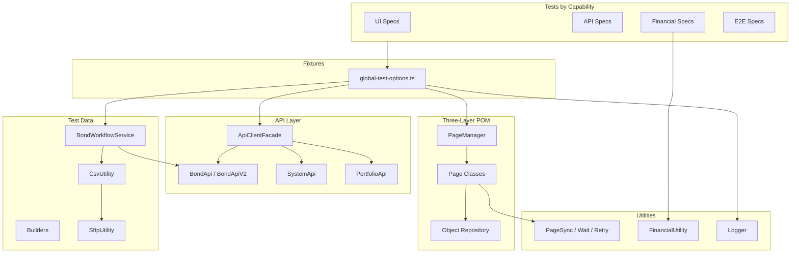

# Architecture — BIS Automation Framework

## Goals

A production-grade Playwright framework that a capital-markets engineering org can maintain for years: clear boundaries, low duplication, typed contracts, and reliable synchronization.

## High-Level Diagram

## Layer Rules

### Object Repository
- Locators only; imports only `@playwright/test`
- No waits, assertions, or business logic
- Dynamic locators return `Locator`, never strings

### Page Classes
- Extend locator classes
- Own `pageSyncUtility`, `testUtility`, `pageManager`
- Every navigation/API-triggering click waits on a network or load signal

### PageManager
- Lazy init: `this.x ??= new X(...)`
- Single registration point for pages

## API Design

| Client | Domain |
|--------|--------|
| `SystemApi` | Business date, advance, reset |
| `BondApi` | v1 bonds + subscribe |
| `BondApiV2` | v2 bonds + subscribe |
| `PortfolioApi` | Portfolio / coupons / maturities |

Validators live in `api/api-validators` and assert shape + cross-version consistency.

## Financial Engine

`FinancialUtility` uses `decimal.js` for:
- Daily coupon = `faceValue × couponRate × allocatedQuantity`
- Maturity = `faceValue × allocatedQuantity`
- Proportional allocation with `floor`

`DateUtility` encodes Asia/Kuala_Lumpur calendar-day and weekend rules from PRODUCT.md.

## Synchronization Policy

Forbidden: `waitForTimeout` as a readiness strategy (short sleeps only appear in negative upload “give poller time” probes after intentional non-events).

Preferred:
- `waitForResponse` paired with clicks
- `waitForURL` / `waitForLoadState`
- `RetryUtility.until` for bond ingestion and status transitions

## Extension Guide

| Change | Where |
|--------|-------|
| New locator | `*-locators.ts` only |
| New UI action | matching `*-page.ts` |
| New page | locator + page + PageManager getter |
| New API | client method + optional validator |
| New bond scenario | `BondBuilder` / `CsvBuilder` |

## Naming Conventions

- Locators: `marketplace-locators.ts`
- Pages: `marketplace-page.ts`
- Specs: `{capability}.spec.ts`
- Tags: `@smoke`, `@e2e`, `@financial`
